# Top-Journal Palette Miner

[English](README.md) | [简体中文](README.zh-CN.md)

> Extract the colour logic, not just the colour codes.

Top-Journal Palette Miner is an agent-ready workflow and Python utility for reverse-engineering the colour grammar of scientific figures. It identifies candidate structural neutrals, data colours, dark anchors, rare accents, and approximate area shares, then helps translate them into reusable, accessible scientific-visualisation systems.

The aim is not to copy journal artwork. It is to make strong visual decisions explicit, reviewable, and reusable.

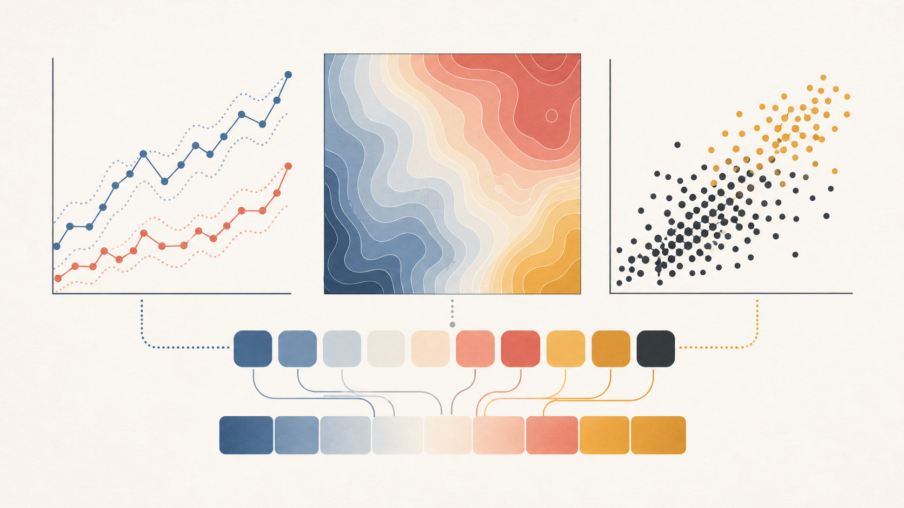

## Why it is different

Most palette extractors return dominant RGB values. Scientific figures need more context:

- colours may belong to different panels and never co-occur;
- rare accents can matter more than dominant backgrounds;
- anti-aliasing, transparency, compression, and resizing create false colours;
- colour roles matter more than raw frequency;
- a palette must survive small marks, grayscale output, and colour-vision variation.

## Status

**v0.1.1: specification-first release with a working candidate extractor and four traceable CC BY 4.0 publication cases.** The extractor supplies evidence for review rather than pretending visual semantics can be inferred perfectly from pixels alone.

The current command-line extractor accepts raster images supported by Pillow. PDF/SVG ingestion, perceptual clustering, and automatic panel analysis remain roadmap items.

## Gallery: colour roles change with figure type

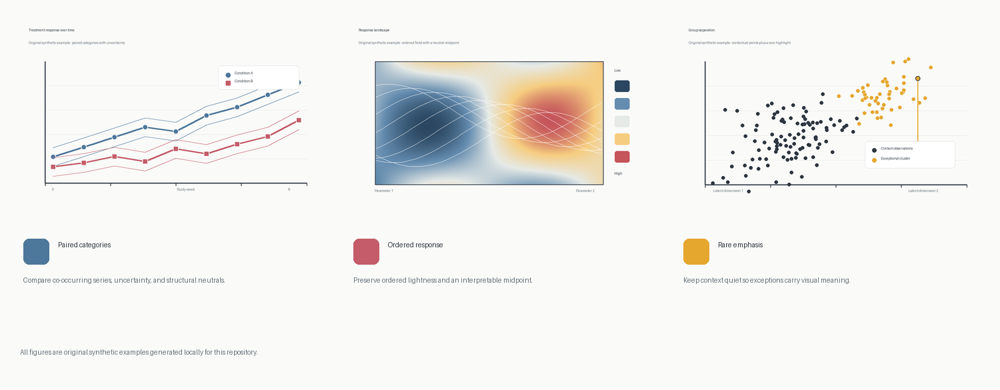

The gallery contains original, locally generated examples rather than borrowed journal artwork. Each one tests a different decision a flat palette extractor cannot make alone:

| Figure family | What to preserve | Example |
| --- | --- | --- |
| Paired categories | Comparable visual weight, uncertainty, and structural neutrals | 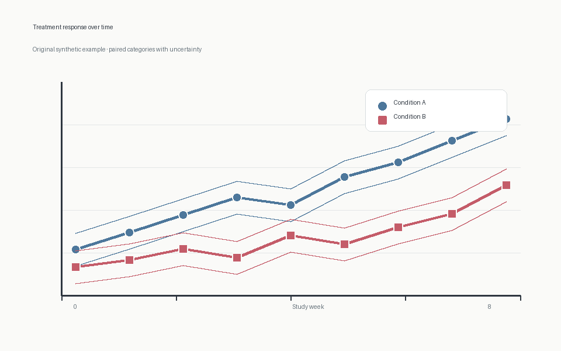 |
| Ordered response | Monotonic lightness and a meaningful neutral midpoint | 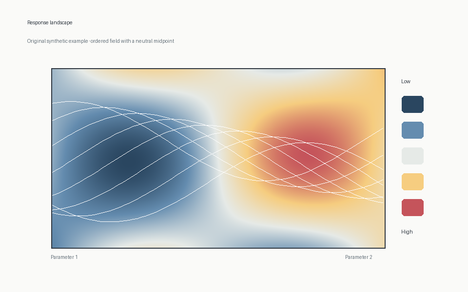 |
| Rare emphasis | Quiet contextual data and a visually distinct exception | 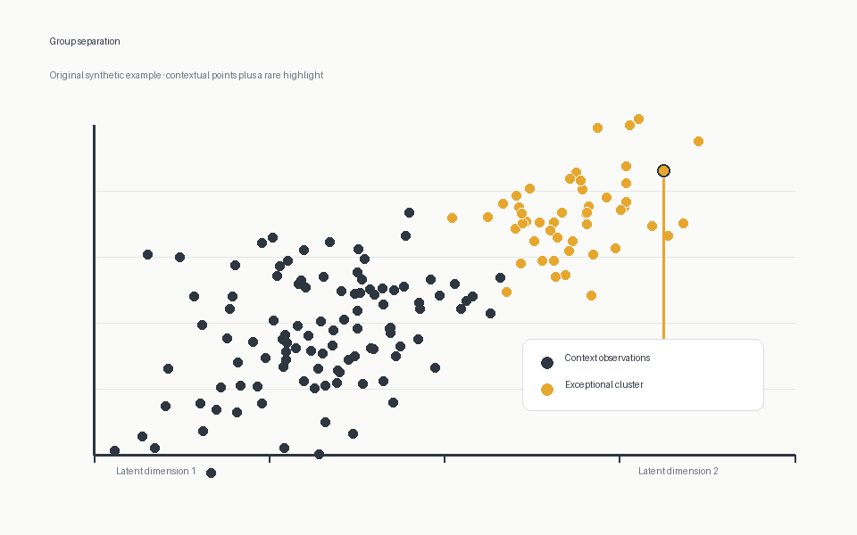 |

See [`examples/ASSETS.md`](examples/ASSETS.md) for asset provenance and the policy for future licensed third-party examples.

## Openly licensed publication case studies

The gallery above is original project artwork. The cases below are real, publisher-hosted figures chosen only after checking an explicit article-level **CC BY 4.0** licence and the selected figure caption for a third-party-material exclusion. Each case keeps its DOI, direct source URL, SHA-256, licence evidence, full attribution, and change record beside the asset.

The repository's MIT License does **not** relicense these figures or their derived palette previews; see [`THIRD_PARTY_NOTICES.md`](THIRD_PARTY_NOTICES.md) and [`examples/licensed-figures/`](examples/licensed-figures/). The previews are candidate extractions, not publisher-authorised palettes.

| Real CC BY 4.0 source | Derived candidate palette | Colour lesson |
| --- | --- | --- |
|  <br> [Stalhandske et al., 2024, Fig. 1](examples/licensed-figures/scientific-reports-2024-s41598-024-55775-2-fig-1/) | 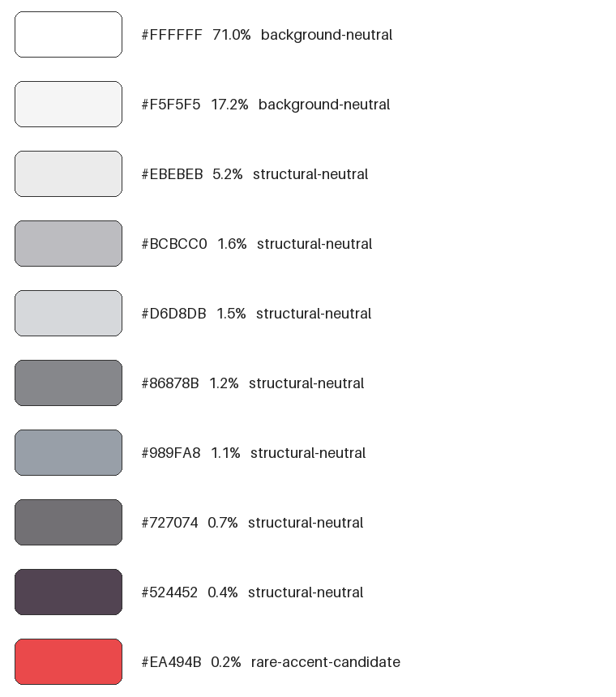 | Semantic category colours can occupy very little area. |
| 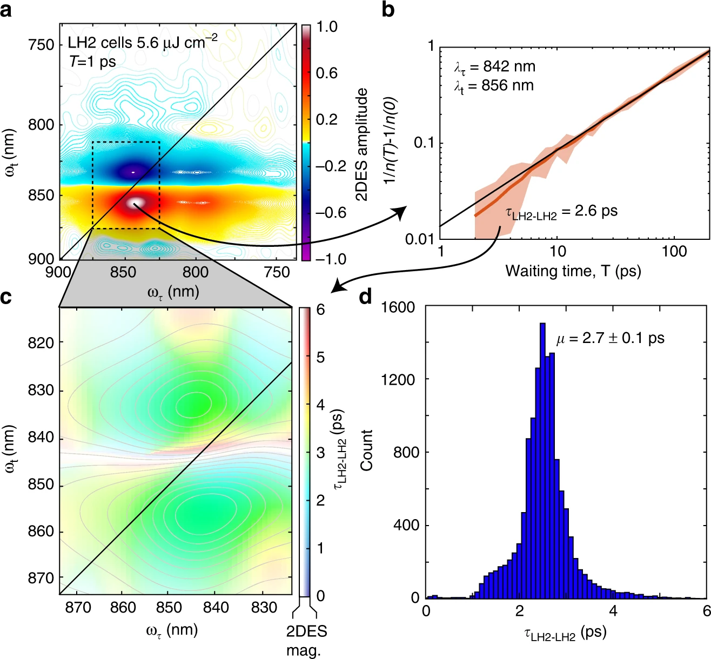 <br> [Dahlberg et al., 2017, Fig. 2](examples/licensed-figures/nature-communications-2017-s41467-017-01124-z-fig-2/) | 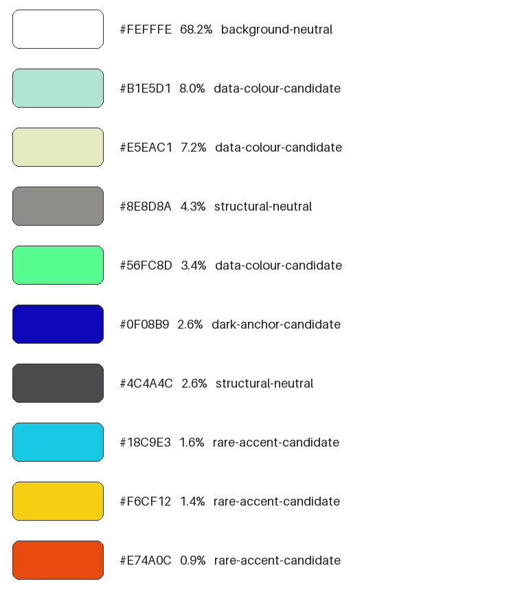 | A continuous field, contours, and axes need different roles. |
| 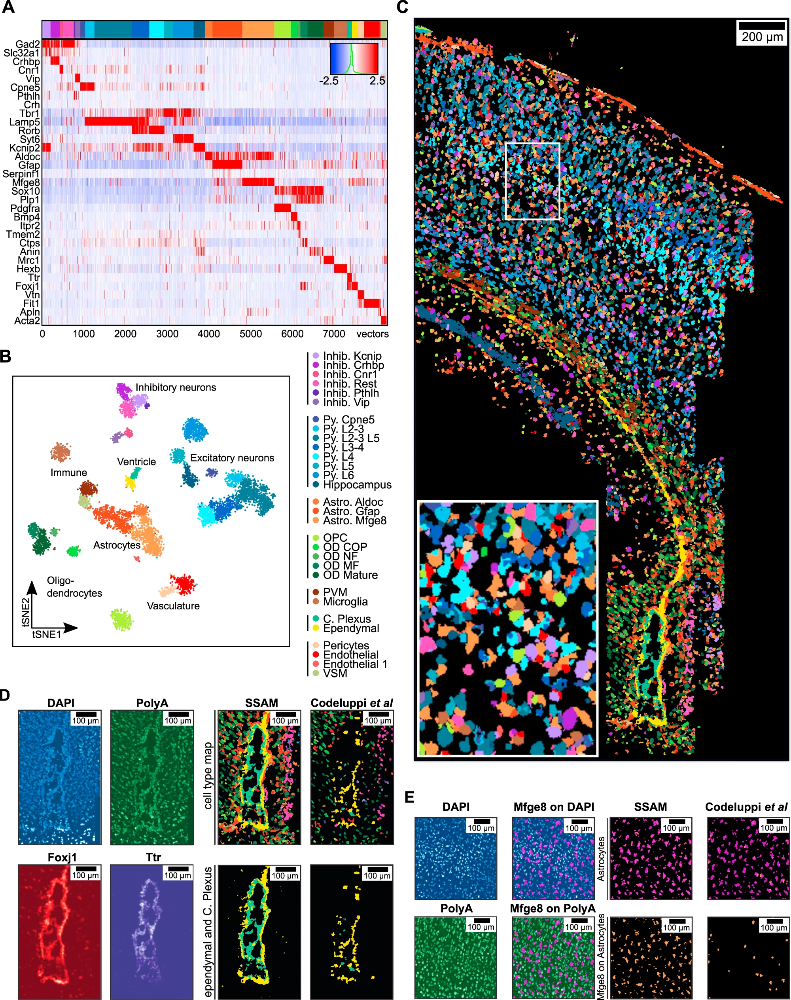 <br> [Park et al., 2021, Fig. 2](examples/licensed-figures/nature-communications-2021-s41467-021-23807-4-fig-2/) | 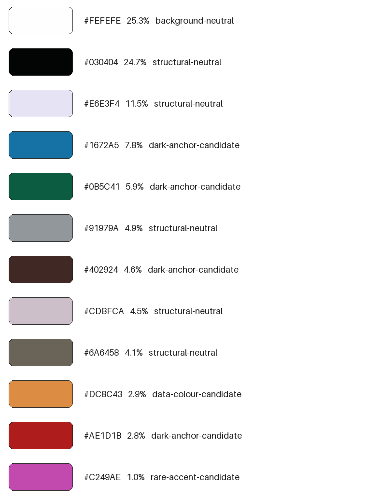 | Multichannel figures demand panel-level review. |
| 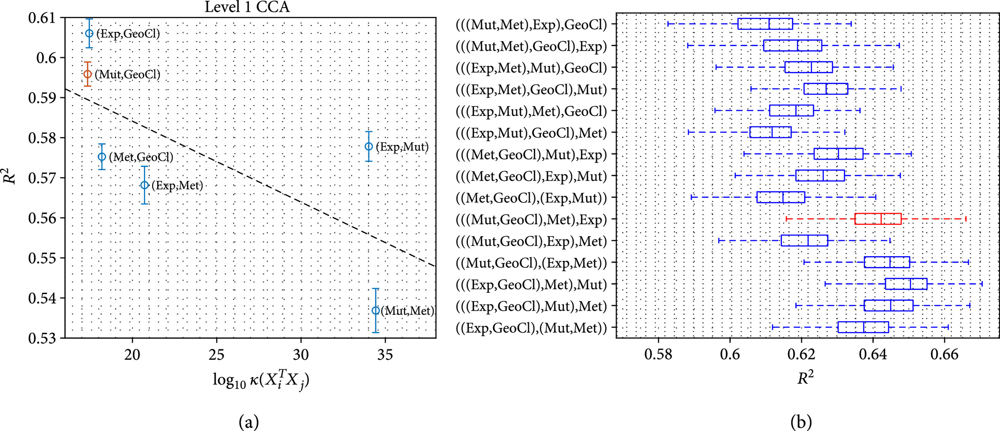 <br> [Petegrosso et al., 2020, Fig. 5](examples/licensed-figures/plant-phenomics-2020-1969142-fig-5/) | 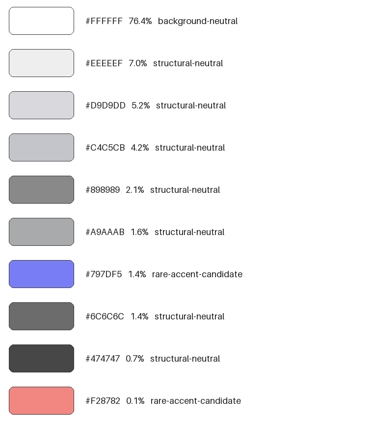 | A rare red trace can be the main semantic emphasis. |

All four article links, licences, and complete attribution statements are in their case folders. The figures are used under [CC BY 4.0](https://creativecommons.org/licenses/by/4.0/); no author, journal, or publisher endorsement is implied.

## Candidate extractor example

| Synthetic scientific figure | Extracted candidate palette |
| --- | --- |
| 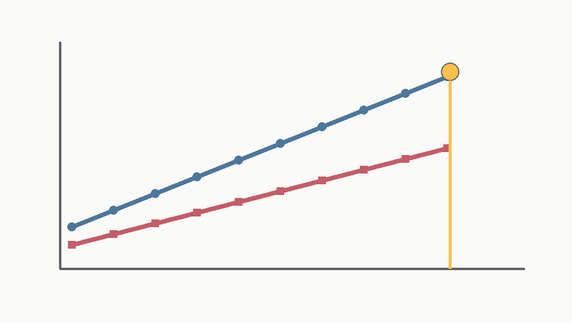 | 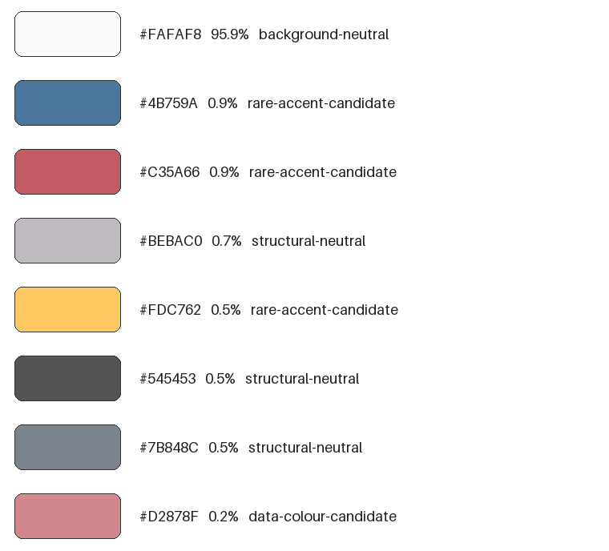 |

The bundled example is synthetic and contains no third-party journal artwork.

## Quick start

Requires Python 3.10 or newer.

```bash
python -m pip install -r requirements.txt
python examples/generate_example.py
python skills/top-journal-palette-miner/scripts/mine_palette.py examples/synthetic-scientific-figure.png --output-dir output
```

Run these commands from the repository root. The final command creates:

- `output/palette.json`: machine-readable candidates and extraction metadata;
- `output/palette.csv`: a compact table for analysis or spreadsheet use;
- `output/palette-preview.png`: a visual review sheet.

Useful options:

```text
--colors 8          Number of candidate clusters
--max-pixels 120000 Maximum pixels sampled after resizing
--seed 17           Random seed for deterministic clustering
```

Run `python skills/top-journal-palette-miner/scripts/mine_palette.py --help` for the complete CLI reference.

## Install as a Codex skill

Copy [`skills/top-journal-palette-miner`](skills/top-journal-palette-miner) into your Codex skills directory, or install it from this repository with your normal Codex skill workflow. Then invoke:

```text
Use $top-journal-palette-miner to analyse this scientific figure and recommend a reusable palette.
```

The Python extractor produces candidates; the skill guides semantic review, accessibility checks, and transfer to a target figure. See the [output schema](skills/top-journal-palette-miner/references/output-schema.md) and [accessibility notes](skills/top-journal-palette-miner/references/accessibility.md).

## Limitations

- Candidate roles are heuristic labels, not ground truth.
- RGB clustering is not yet perceptually uniform.
- Area share can overemphasise large backgrounds and understate thin but important marks.
- Anti-aliasing and compression may introduce colours that were not intentionally designed.
- Multi-panel figures still require panel-level human review.

## Copyright and responsible use

- Do not redistribute journal figures unless their licence permits it.
- Prefer original, synthetic, or openly licensed public examples.
- Record source provenance and describe screenshot-derived colours as approximate.
- Do not present extracted colours as a publisher's official palette.

The code here is an original implementation. No third-party MATLAB code is included. This project is not affiliated with or endorsed by any journal or publisher.

## Roadmap

- perceptual clustering in OKLab;
- panel-level co-occurrence detection;
- colour-vision simulation and contrast reports;
- manual click-to-sample review interface;
- searchable palette-library records and format exports.

## Contributing

Issues and pull requests are welcome. Please read [CONTRIBUTING.md](CONTRIBUTING.md) before contributing. In particular, do not upload copyrighted journal figures without permission or a compatible licence.

## Citation and licence

Use [`CITATION.cff`](CITATION.cff) to cite the project. Released under the [MIT License](LICENSE).
