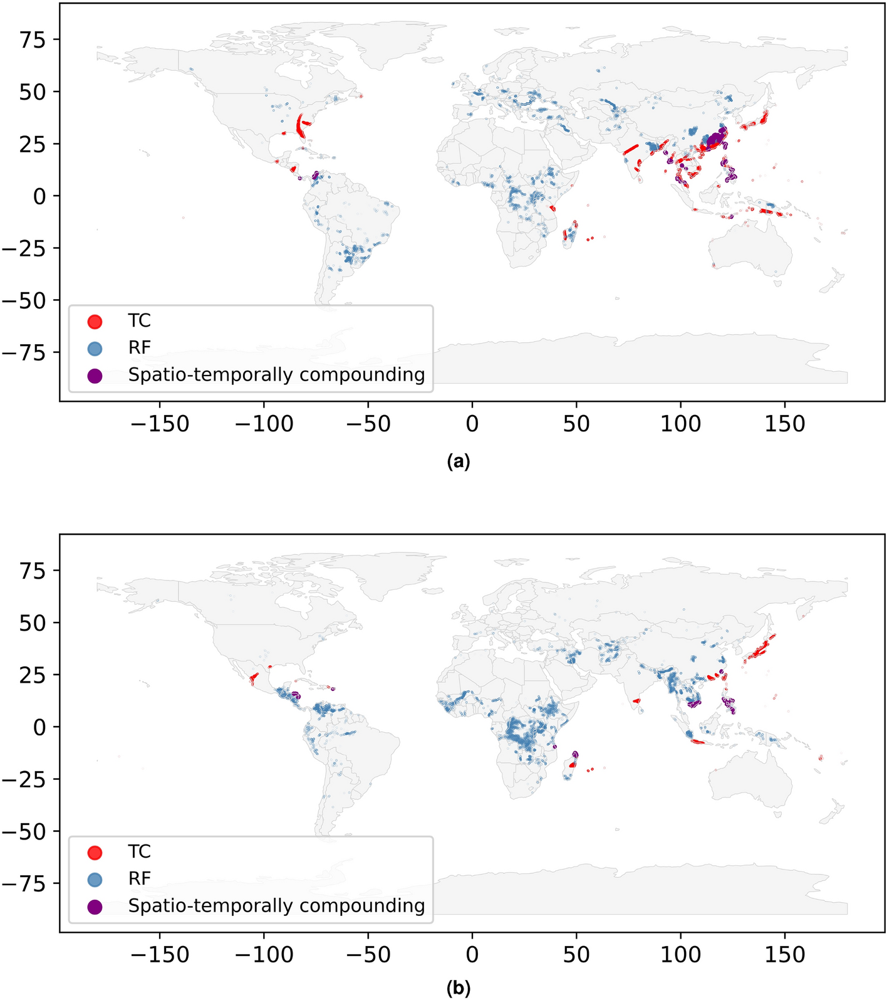

# Scientific Reports (2024), Figure 1 — categorical multi-hazard states

**Colour question:** red, blue, purple, and grey encode discrete hazard states. A usable palette analysis should preserve their categorical relationship and resist treating the pale map background as the main result.

**Attribution:** Figure 1 from Stalhandske, Z., Steinmann, C. B., Meiler, S. et al. *Global multi-hazard risk assessment in a changing climate*, *Scientific Reports* 14, 5875 (2024), [doi:10.1038/s41598-024-55775-2](https://doi.org/10.1038/s41598-024-55775-2). © The Author(s) 2024. Used under [CC BY 4.0](https://creativecommons.org/licenses/by/4.0/). Source: [Nature Portfolio figure page](https://www.nature.com/articles/s41598-024-55775-2/figures/1). No project-side edits were made to `source-figure.png`; palette outputs are derived analyses. No endorsement is implied.

See [`metadata.yml`](metadata.yml) for the source hash, rights check, and reproducible analysis command. The repository MIT licence does not apply to this case.
